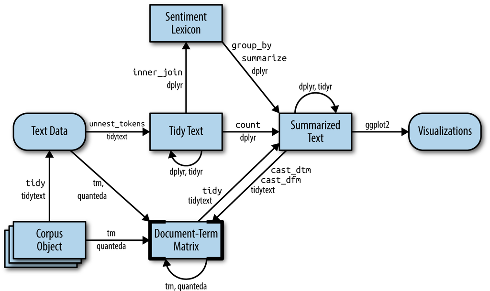

```{r setup, include=FALSE}
knitr::opts_chunk$set(echo = TRUE, message = FALSE, warning = FALSE)
```

#  5 Converting to and from non-tidy formats 

this chapter will discuss the "glue" that connects the tidy text format with other important packages and data structures, allowing you to rely on both existing text mining packages and the suite of tidy tools to perform your analysis.


```{r tidyflowchartch5, echo = FALSE, out.width = '100%', fig.cap = "A flowchart of a typical text analysis that combines tidytext with other tools and data formats, particularly the tm or quanteda packages. This chapter shows how to convert back and forth between document-term matrices and tidy data frames, as well as converting from a Corpus object to a text data frame."}

```

Figure \@ref(fig:tidyflowchartch5) illustrates how an analysis might switch between tidy and non-tidy data structures and tools. 

## Tidying a document-term matrix {#tidy-dtm}

One of the most common structures that text mining packages work with is the [document-term matrix](https://en.wikipedia.org/wiki/Document-term_matrix) (or DTM). This is a matrix where:

* each row represents one document (such as a book or article),
* each column represents one term, and
* each value (typically) contains the number of appearances of that term in that document.

DTM objects cannot be used directly with tidy tools, just as tidy data frames cannot be used as input for most text mining packages. Thus, the tidytext package provides two verbs that convert between the two formats.

* `tidy()` turns a document-term matrix into a tidy data frame. This verb comes from the broom package [@R-broom], which provides similar tidying functions for many statistical models and objects.
* `cast()` turns a tidy one-term-per-row data frame into a matrix. tidytext provides three variations of this verb, each converting to a different type of matrix: `cast_sparse()` (converting to a sparse matrix from the Matrix package), `cast_dtm()` (converting to a `DocumentTermMatrix` object from tm), and `cast_dfm()` (converting to a `dfm` object from quanteda).

## 5.2 Casting tidy text data into a matrix

Just as some existing text mining packages provide document-term matrices as sample data or output, some algorithms expect such matrices as input. Therefore, tidytext provides cast_ verbs for converting from a tidy form to these matrices.

This kind of conversion could easily be done from any of the tidy text structures we’ve used so far.
For example, we could create a DTM of monthly Covid19 Tweets in just a few lines of code.

```{r tweets_dtm}
library(dplyr)
library(tidytext)
data("tidy_tweets")
tweets_monthcnt <- tidy_tweets %>%
  count(month, word) 

 
tweets_dtm <- tweets_monthcnt %>%
  cast_dtm(month, word, n)
tweets_dtm
```
But also a DFM

```{r}
tweets_monthcnt %>%
  cast_dfm(month, word, n)
```

```{r}
library(Matrix)
tweets_monthcnt %>%
  cast_sparse(month, word, n)

```

Or eaven a Sparse Matrix 
